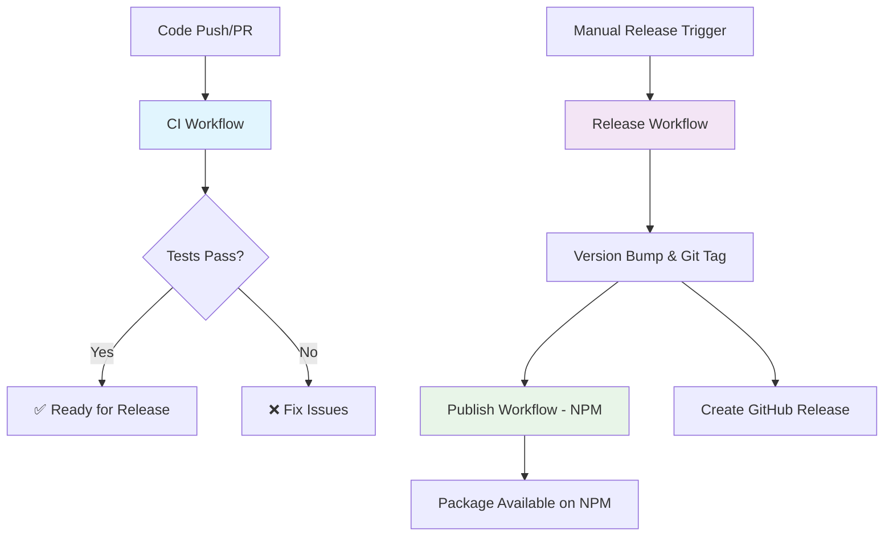

# GitHub Actions Workflows

This repository uses three separate GitHub Actions workflows for different purposes:

## 🔄 CI Workflow (`.github/workflows/main.yml`)

**Trigger**: Every push and pull request to `main` or `develop` branches

**Purpose**: Continuous Integration testing

**Jobs**:
- **Test**: Runs tests on Node.js 16.x, 18.x, and 20.x
- **Security**: Runs security audit

**What it does**:
- ✅ Installs dependencies
- ✅ Runs linting
- ✅ Runs type checking  
- ✅ Runs test suite with coverage
- ✅ Builds the project
- ✅ Uploads coverage to Codecov
- ✅ Runs security audit

## 🚀 Release Workflow (`.github/workflows/release.yml`)

**Trigger**: Manual dispatch (you trigger it manually)

**Purpose**: Create new releases with automatic versioning

**What it does**:
- ✅ Runs full CI pipeline (tests, linting, building)
- ✅ Bumps version in package.json (patch/minor/major)
- ✅ Creates git commit and tag
- ✅ Generates changelog from commits
- ✅ Creates GitHub release
- ✅ Triggers the publish workflow

## 📦 Publish Workflow (`.github/workflows/publish.yml`)

**Trigger**: When a new version tag is pushed (e.g., `v1.0.0`)

**Purpose**: Publish package to NPM

**What it does**:
- ✅ Runs tests and builds (safety check)
- ✅ Updates package.json version to match tag
- ✅ Publishes to NPM registry
- ✅ Uploads package tarball to GitHub release

## Workflow Sequence

## Release Process

1. **Development**: Code changes trigger CI workflow
2. **Ready to Release**: Use manual release workflow 
3. **Automatic Publishing**: Tag creation triggers NPM publish immediately
4. **GitHub Release**: Created after tag for documentation

## Benefits of This Structure

- **🔒 Separation of Concerns**: Each workflow has a single responsibility
- **🚀 Fast CI**: CI runs quickly without publish overhead
- **📦 Reliable Publishing**: Dedicated publish workflow with safety checks
- **🎯 Manual Control**: You choose when to release
- **⚡ Fast Publishing**: NPM publish triggers immediately on tag creation
- **🛡️ Safety**: Multiple test gates before publishing 